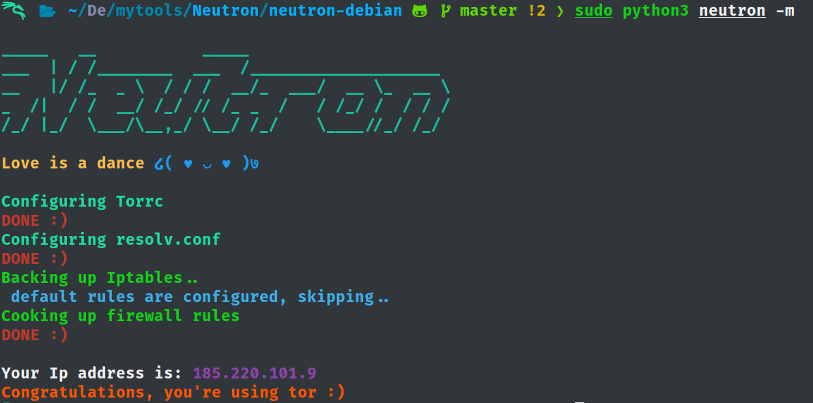
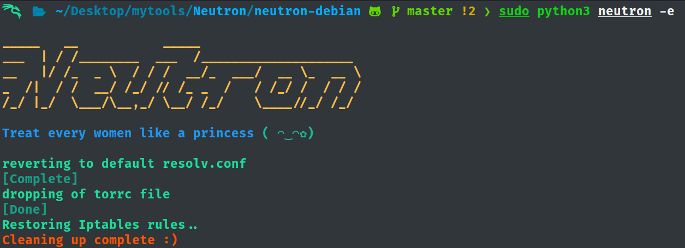

## Neutron, a powerful and stealthy traffic anonymizer.

Neutron anonymizes the entire system traffic using tor as a transparent proxy(even the Dns). Written in python3, neutron works seamlessly in both Debian and Arch based distros.

The good thing about neutron is it's stealthy, visually inspiring, and it deals with configs as delicately as possible.

All you gotta do is clone the repo and run the installer.


## How to install Neutron:

``git clone https://github.com/Feliz-SZK/Neutron.git``

``cd Neutron``

**for Arch based distros**
 
``cd neutron-arch`` 

**for Debian based distros**

``cd neutron-debian``
 
 Finally:
 
``chmod +x installer.sh``

``sudo ./installer.sh``

### Usage:

```ascii
 -h, --help               show this help message and exit         
 -m, --mask               start anonymizing                       
 -e, --expose             get back to surface-web                 
 -i, --ip                 check current IP address                
 -s, --shuffle            connect to a different exit-node        
 -w, --whatami            check if using tor                      
 -n, --nuke               backs up and reset Iptables to default. 
```
**anonymizing,**



**Returning to surface-web,**



----
### Somethin Personal

>>I wrote this back in college, it's when I realized writing code ain't that bad; you just gotta have a sense of purpose, you know.
Talking about purpose and whatnots, I ain't no stranger to self-loathing or what kids call Heartache these days. I've added these Quotes I like and some of my own. They're kind of childish but I hope it brings a smile to your face; till then take care and don't be another brick in the wall :)
----

## Precautions

* Do not use tor browser while running neutron

**You may think you get 6 hops; but the thing is the extra 3 hops may not be different they could be the same or in mixed order(this said to be vulnarable as the routing order is not over tor anymore), so using tor-browser while running tor as a transparent proxy is highly discouraged.**

* Neutron can keep your identity in grey but can't protect if your system is compromised.

**If there's a backdoor or a rootkit in your system; nay an regular program if running with superuser privilages, it could read your hardware deets(serial no, firmware version, Mac address), host name, could discover other devices in your network, get their details even exploit them. Keep in mind, Neutron can't protect you in such scenarios. Using tails or similar OS could isolate you completely unless someone come up with an Zero Day.**

**Also, doesn't matter if you're running Neutron in your VM or host OS, please consider changing the host-name and MAC address.**


## License & copyright
 
© Salim Zaved Karim
 
Licensed under the [GPL-V3.0 License](https://github.com/Feliz-SZK/Neutron/blob/master/LICENSE).


### Credits and References:

Nuke Asci art work: https://boxes.thomasjensen.com

Firewall Rules: [The tor project documentation.](https://gitlab.torproject.org/legacy/trac/-/wikis/doc/TransparentProxy)

---


