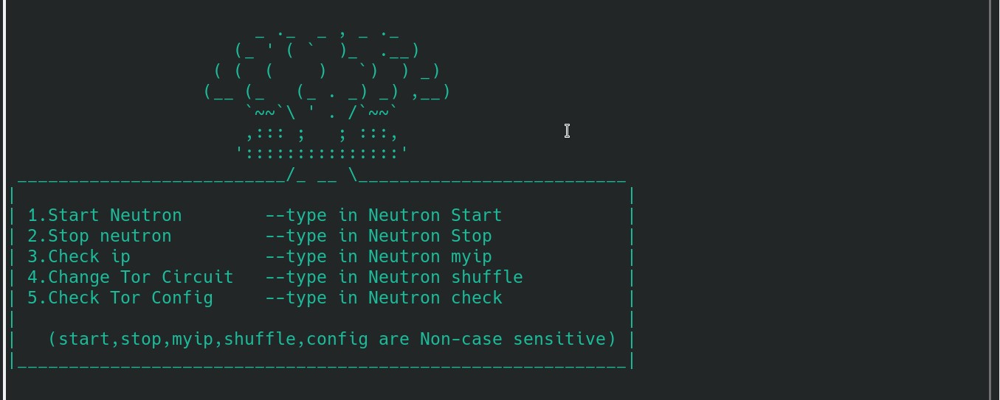

## Neutron, a powerful and smart traffic anonymizer.

**Neutron anonymizes the entire system traffic using tor as a transparent proxy(Even the Dns).**

**As it uses the new Dns Port ``5353`` it's quite faster over port ``53``**

**All you gotta do is clone the repo and get into the directory depending on your distro and run the installer**

## How to install Neutron:

``git clone https://github.com/Feliz-SZK/Neutron.git``

``cd Neutron``

for Arch based distros
 
``cd Neutron-A`` 

for Debian based distros

``cd Neutron-D``
 
 Finally:
 
``chmod +x installer.sh``

``./installer.sh``

### How to Use Neutron:

From terminal type-in ``neutron`` for usage:

type-in ``neutron start`` to start anonynizing

