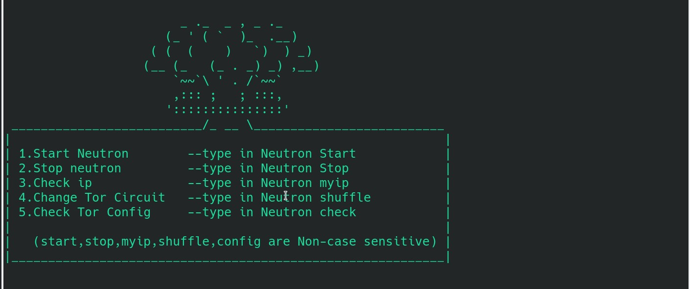
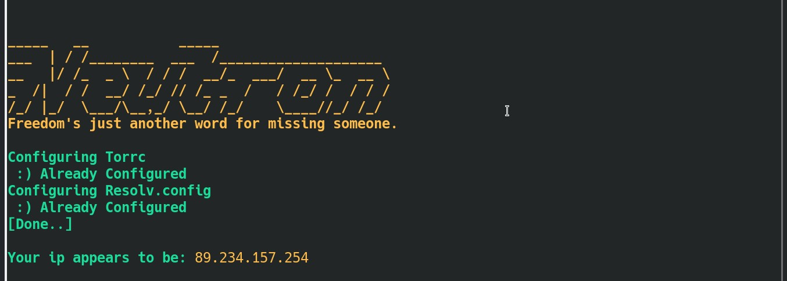
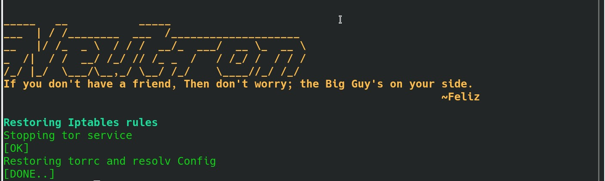
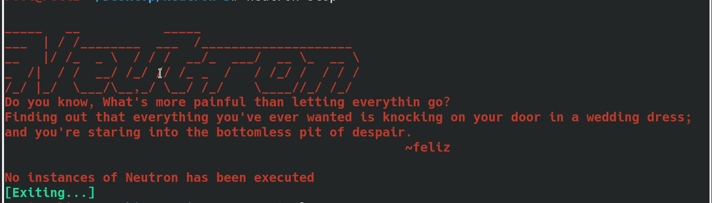
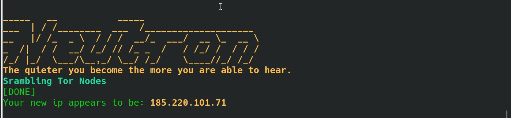
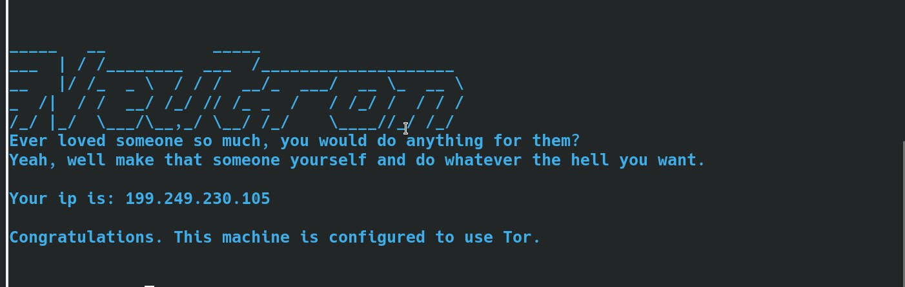
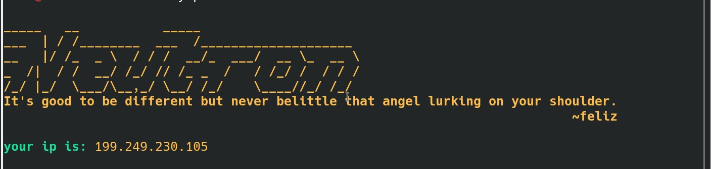

## Neutron, a powerful and smart traffic anonymizer.

**Neutron anonymizes the entire system traffic using tor as a transparent proxy(Even the Dns).**

**All you gotta do is clone the repo and get into the directory depending on your distro and run the installer**

## How to install Neutron:

``git clone https://github.com/Feliz-SZK/Neutron.git``

``cd Neutron``

**for Arch based distros**
 
``cd Neutron-A`` 

**for Debian based distros**

``cd Neutron-D``
 
 Finally:
 
``chmod +x installer.sh``

``sudo ./installer.sh``

### How to Use Neutron:

***e.g.*** everything after ``neutron`` is non case sensitive(example: ``neutron StArT`` and every other possible combinations are good to go.)

**From terminal type-in ``neutron`` for usage:**



***type-in ``neutron start`` to start anonynizing***



**to stop the process, type-in**

``neutron stop``
***if your system hs instances of neutron running; only then it'll execute otherwise not***






**Now, to change your ip aka to hop on a different tor exit Node, type-in**

``neutron shuffle``



**Now, to check if you're using tor type-in**
```bash
neutron check
```



***to, check your ip type-in**
```bash
neutron myip
```



----
### Somethin Personal

>>I've been planning to finish this project for a while now but my other head has some different plans so it took some time. but It's here so good for me.
As I'm no stranger to self-loathing or what kids call Heartache these days; I've included some Quotes that I like and some of my own; I hope this might help when you start Neutron to revolutionize the world or just to look cool. Cause no matter what it's just a matter of seconds to bring the best in you.


----

## Precautions

* Do not run tor browser while running neutron

**Cause you'll think you get 6 hops; but the thing is the extra 3 hops may not be different they could be the same or in mixed order(this said to be vulnarable as the routing order is not over tor anymore), so accessing tor browser while running tor as a transparent proxy is highly discouraged.**


## License & copyright
 
© Salim Zaved Karim
 
Licensed under the [MIT License](https://github.com/Feliz-SZK/Neutron/blob/master/LICENSE).


## Credits for the nuke Asci art work:
https://boxes.thomasjensen.com/


